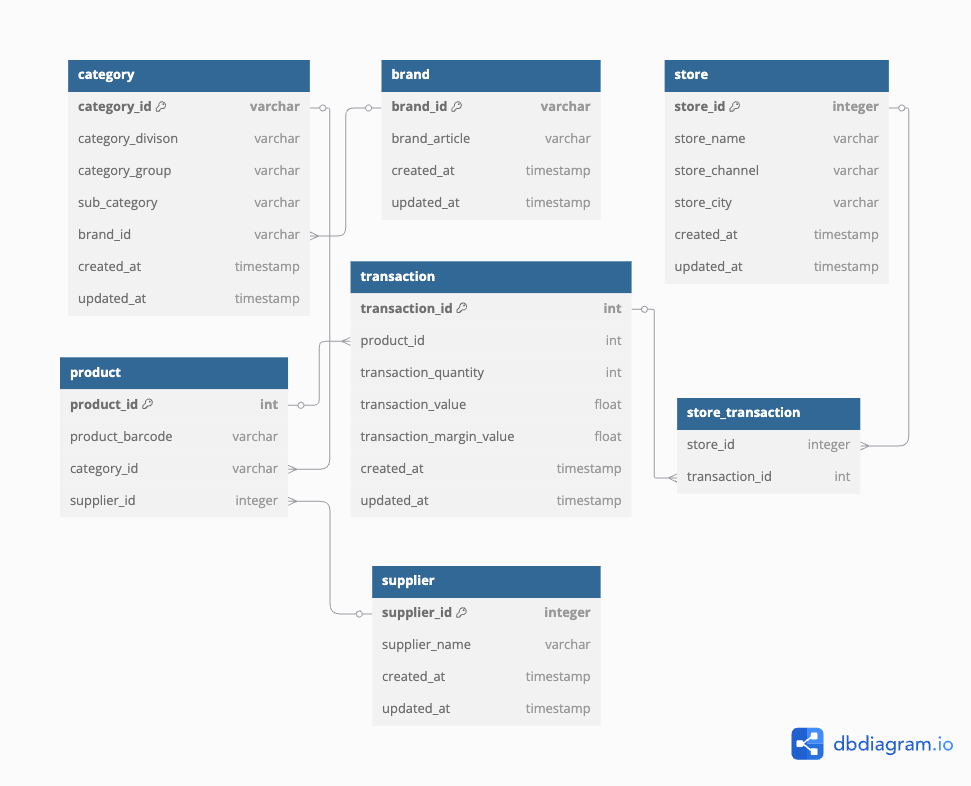

# Database Schema Documentation

## Overview

The database schema for this project can be viewed at [dbdiagram.io](https://dbdiagram.io/d/hpt-demo-test-case-67b6b7d2263d6cf9a0cf1e4c).

## Viewing Instructions

1. Click on the link above to access the database diagram
2. The diagram shows the relationships and structure of our database tables
3. You can interact with the diagram to:
   - Zoom in/out
   - Pan across the diagram
   - View table relationships
   - See column details

## Note

If you need to make changes to the schema, please contact the project maintainers.
